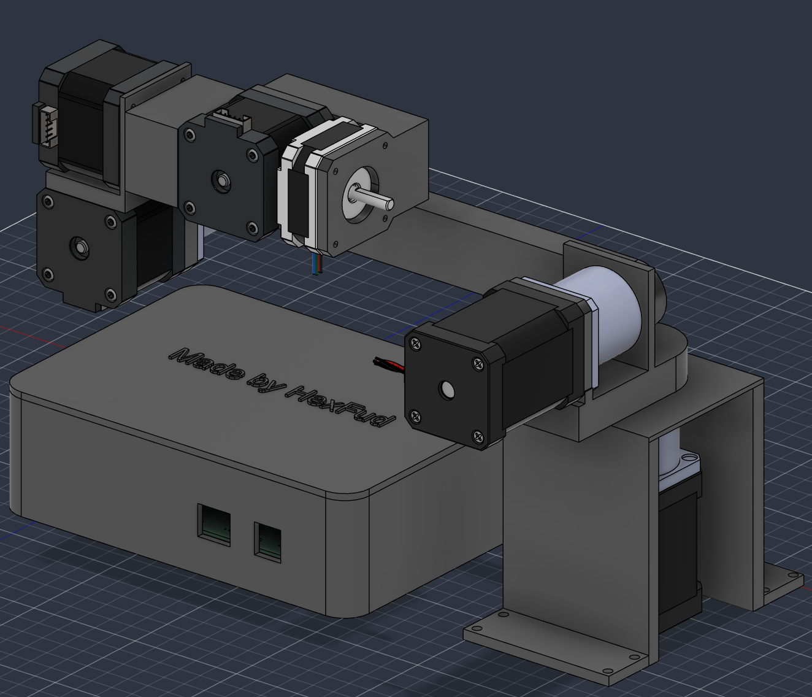
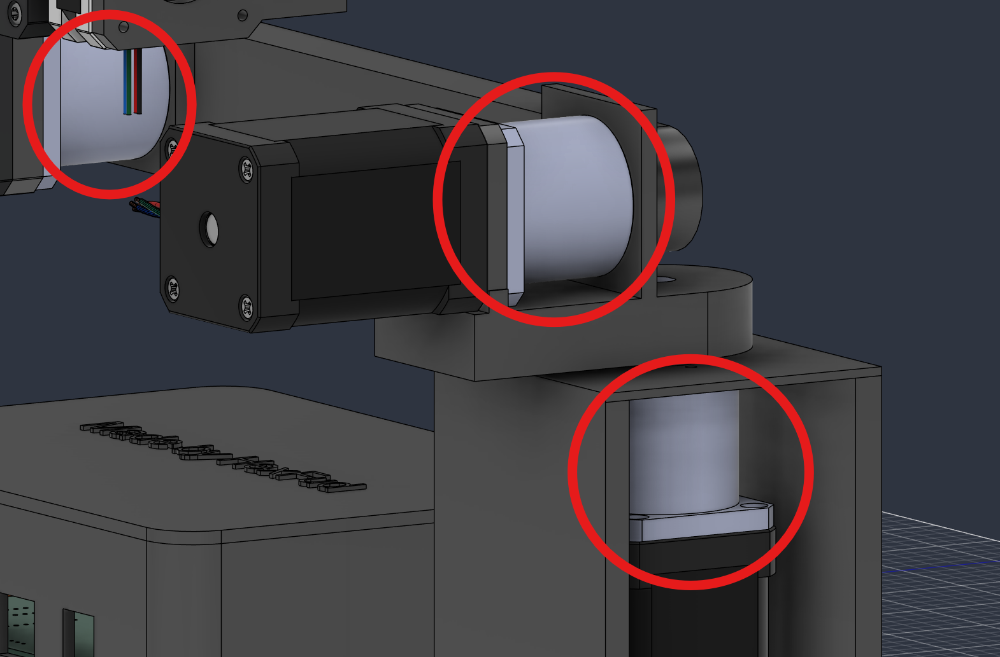
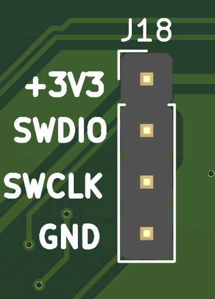

## 6 Axis Robotic Arm

I created this 6 axis robotic arm entirely from scratch starting from the PCB to the 3D modelling and designing.

## How this was made

I designed the PCB that can take up to 6 motors (I used 6 NEMA 17) with 6 driver boards that you can directly plug into the PCB. In the PCB case there is a cutout for a 40mm fan directly pluggable into the dedicated +5V socket (identified by FAN or J8 connector), this is foundamental to keep the motor drivers cool and keep things as safe as possible. The board runs on 24V connection and includes connections for:

1. **6 limit switches** for homing each joint
2. **A CAN Bus interface**
3. **An emergency stop button socket** for safety reason. 

## External connections breakdown

1. **E-STOP (J21)** The emergency stop circuit is NC so the board without this button won't power on, if you want to avoid this you can short 2 pins of the J21 connector with a jumper (please mind your safety)
2. **CAN Bus (J22)** This is the port to make the PCB comunicate with the PC and it only has 2 pins CAN_H and CAN_L if you want to send commands directly to the board you need to have a USB-CAN adapter
3. **Power button (J19)** The socket on the PCB has 4 pins
 
| Pin | Function | Where to connect |
| :---: | :--- | :--- |
| **1** | `GND` | Switch contact + LED Negative (`-`) wire |
| **2** | `PWR` | Switch contact |
| **3** | `+3V3` | LED Positive (`+`) wire |
| **4** | `Reserved` | *Do not connect any wire to it* |

## Mechanical design and why I chose certain components

To make sure the arm can lift certain payloads wihout struggling I preferred to not use a direct-drive style to move the joints, this is why for the most heavy and tourqe demanding parts I paired the NEMA 17 motors with 20:1 and 10:1 gearboxes (you can see them marked in red)

## How to flash the firmware

My project doesn't have a USB-C or other type of interfaces so to flash the firmware you need a ST-LINK V2 where you need to wire up the correct cable from the usb to the board (J18 connector) and download the free software [STM32CubeProgrammer](https://www.st.com/content/st_com/en/stm32cubeprogrammer.html) and you simply need to upload the firmware.

## Filament reccomendation

Because stepper motors and the drivers generate heat around 50°C-60°C I strongly reccomend to use filaments like PETG, ABS or ASA instead of standard PLA ensuring the plastic won't soften, warp or melt during intensive load.

## ⚠️⚠️ Safety advice ⚠️⚠️

This project includes experimental software, hardware designs, and assembly documentation are still under development and may contain bugs, errors, or incomplete features. By using, building, or modifying this project, you acknowledge that:

1. You use this project entirely at your own risk
2. You are solely responsible for safe assembly, testing, and operation
3. The autor isn't responsible for any type of damage, injury or loss to people or the machine itself

By proceeding, you accept all risks and agree to these conditions. If you do not acknowledge these risks and conditions, please do not use or build this project.
